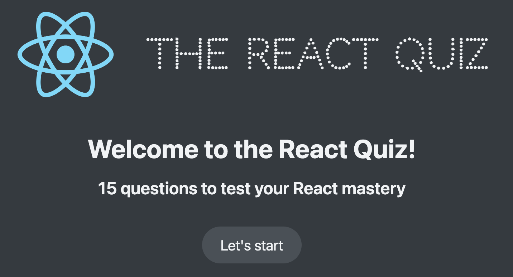
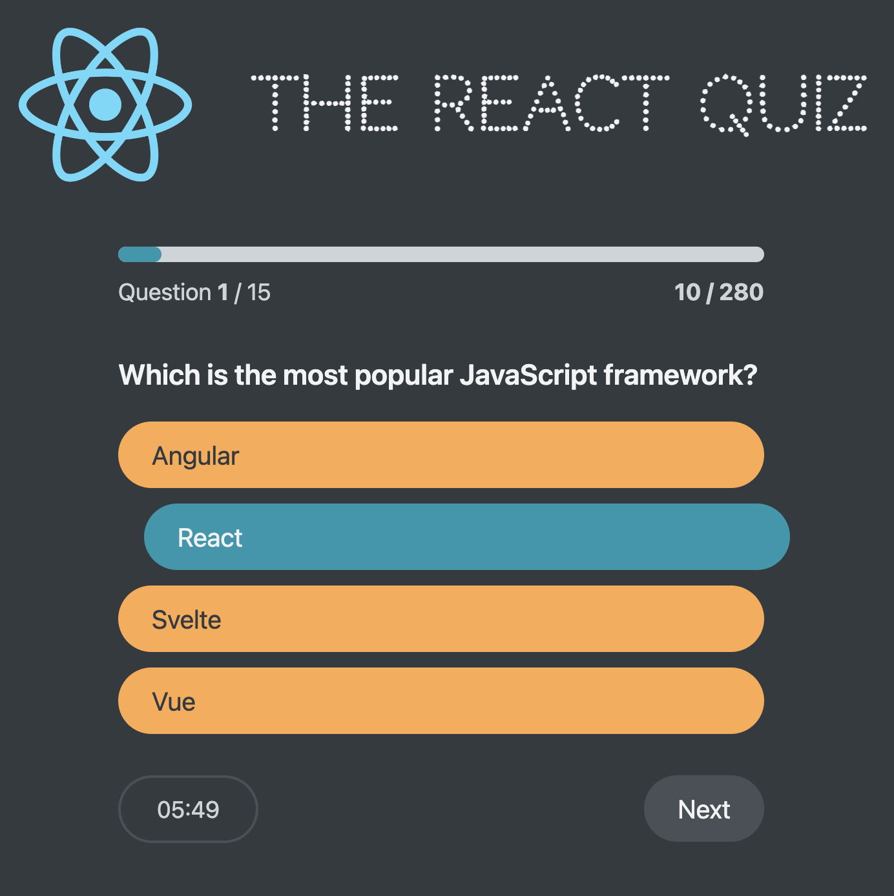
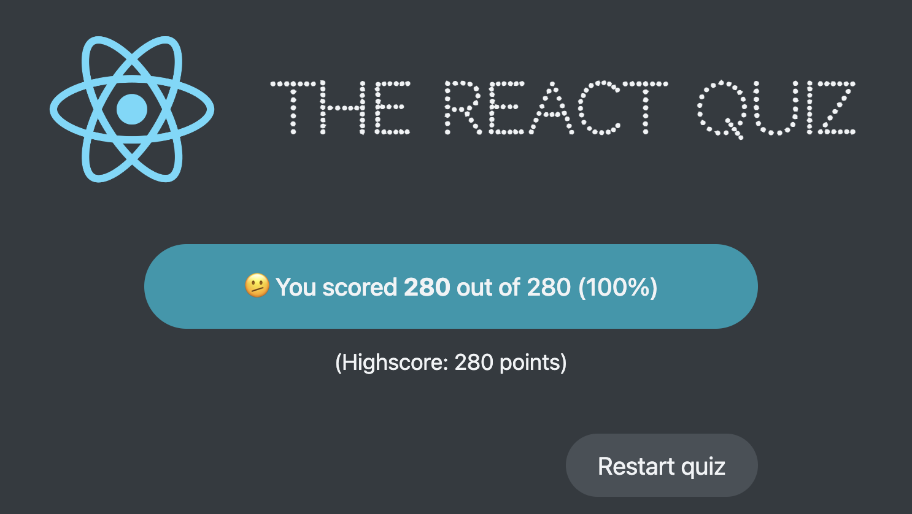

# React Quiz App

This project is a simple quiz application developed using React. It demonstrates how to manage complex state transitions using the `useReducer` hook. The app fetches questions from an API and allows users to answer them within a time limit. It tracks the user's score and high score across sessions.

## Features

- **State Management with `useReducer`:** The app uses React's `useReducer` to handle complex state transitions based on user interaction.
- **Timed Questions:** Each question has a time limit to answer, enforced by a countdown timer.
- **High Score Tracking:** The app keeps track of the user's highest score, which persists across quiz sessions.
- **Dynamic UI:** Different screens and UI elements are shown based on the app's state (loading, error, active, finished, etc.).

## How It Works

The application starts in a `loading` state while fetching quiz questions from an external API (`http://localhost:8000/questions`). Once the data is fetched successfully, the quiz can be started. The quiz timer counts down, and users must answer questions before the time runs out.

The state is managed through a reducer function with various actions that update the state, such as starting the quiz, answering questions, moving to the next question, and tracking the time.

## State Structure

The app's state is defined in an object with the following properties:

- `questions`: An array of quiz questions fetched from the API.
- `status`: The current state of the app, which can be `loading`, `error`, `ready`, `active`, or `finished`.
- `index`: The current question index.
- `answer`: The user's selected answer for the current question.
- `points`: The current score based on correct answers.
- `highscore`: The highest score achieved during the session.
- `secondsRemaining`: The countdown timer for the quiz.

### Reducer Actions

- **`dataReceived`:** Triggered when questions are successfully fetched from the API.
- **`dataFailed`:** Triggered when there is an error fetching the questions.
- **`start`:** Initiates the quiz and sets the total time based on the number of questions.
- **`newAnswer`:** Updates the state with the user's answer and calculates points if the answer is correct.
- **`nextQuestion`:** Moves to the next question and resets the selected answer.
- **`finish`:** Ends the quiz and updates the high score if the current score is higher.
- **`restart`:** Resets the quiz while retaining the high score.
- **`tick`:** Reduces the countdown timer by one second, ending the quiz if time runs out.

## Components

The app consists of several components that handle different parts of the UI:

- **`Header`:** Displays the app's title.
- **`Main`:** Container for the app's main content.
- **`Loader`:** Shown while the app is fetching questions from the API.
- **`Error`:** Shown if there is an issue loading the questions.
- **`StartScreen`:** Initial screen that allows users to start the quiz.
- **`Question`:** Displays the current question and answer options.
- **`NextButton`:** Button to move to the next question.
- **`Progress`:** Displays the user's progress in the quiz.
- **`FinishScreen`:** Shown when the quiz is finished, displaying the user's score and high score.
- **`Timer`:** Displays and manages the countdown timer.
- **`Footer`:** Displays the timer and next button below the quiz content.

## Installation

1.  Clone the repository:
    `git clone https://github.com/yourusername/react-quiz-app.git`
2.  Navigate to the project directory:
    `cd react-quiz-app`
3.  Install the required dependencies:
    `npm install`
4.  Run the app:  
    `npm start`
5.  Make sure your backend API is running at `http://localhost:8000/questions` to provide the quiz data.

## Usage

- Start the app, and the questions will be fetched from the server.
- Once ready, you can start the quiz, answer the questions, and see your score at the end.
- The timer will count down for each question. If time runs out, the quiz ends automatically.
- The high score is tracked and updated at the end of each quiz session.

## Technologies Used

- **React:** Frontend library for building user interfaces.
- **React Reducer (`useReducer`):** For managing complex state transitions.
- **JavaScript:** Core programming language.
- **HTML/CSS:** For structuring and styling the app.
